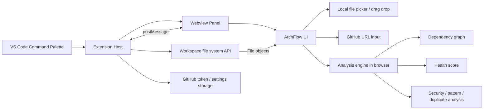

# ArchFlow VS Code Extension Architecture

This repository is currently a browser-first CodeFlow app plus a GitHub Action card. The cleanest way to make it a VS Code extension is to keep the existing analyzer and visualization logic, and wrap it in a VS Code extension host that opens CodeFlow inside a webview.

The ArchFlow extension lives in `extension/`, with its VS Code manifest at the repository
root. From a checked-out repository, launch the
extension in VS Code with `F5`, then run `ArchFlow: Open Architecture Map` from the
command palette. It loads the existing `index.html` and rewrites its checked-in local
assets to webview-safe URIs, so the analyzer remains a single source of truth. Use
`ArchFlow: Analyze Current Workspace` or the toolbar button to send the open folder into
the existing local-folder input flow.

## Architecture Flow

## Data Flow

1. The user runs a VS Code command such as `ArchFlow: Open Architecture Map`.
2. The extension host creates a webview panel and loads the existing ArchFlow frontend.
3. The extension host reads the workspace and sends browser-compatible `File` objects through a small message bridge; the existing folder-input handler receives them.
4. The frontend runs the analysis logic and renders the architecture graph, health score, and security findings.
5. Results stay local unless the user explicitly analyzes a GitHub URL.

## Recommended Extension Shape

Keep the extension thin:

- `extension.ts` registers commands and opens the webview.
- The webview loads the existing UI bundle or the current static app.
- A message bridge handles workspace file reads, configuration, and analysis requests.
- The existing analyzer stays the source of truth so browser and extension behavior match.

## Migration Phases

1. **Complete:** Wrap the current app in a VS Code webview without changing the analyzer.
2. **Complete:** Add workspace file discovery and bridge it into the existing local-folder flow.
3. Add commands for graph view, blast radius, security scan, and export.
4. Optional: add a tree view or side panel for quick navigation.

## Key Constraint

Do not fork the analyzer logic into a second implementation. The extension should reuse the current CodeFlow analysis pipeline so the web app, local browser mode, and VS Code mode stay consistent.
